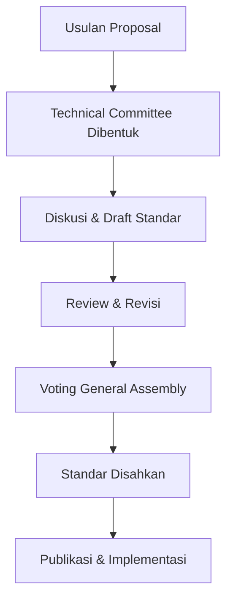

ya aku penasaran gimana proses standar dibuat ?

Asik, ini topik yang seru banget! 😄 Yuk kita bahas **gimana proses pembuatan standar di Ecma International** (dan kenapa itu penting buat dunia teknologi).

---

## 🔧 **Proses Pembuatan Standar di Ecma**

### 1. **Pengajuan Proposal**
- Siapapun (biasanya perusahaan atau organisasi besar) bisa **mengusulkan pembuatan standar baru** atau revisi dari standar yang ada.
- Contoh: Microsoft mengusulkan **C# dan CLI**, Netscape mengusulkan **ECMAScript**.

---

### 2. **Pembentukan Technical Committee (TC)**
- Jika proposal disetujui, Ecma akan membentuk **Technical Committee** (TC).
- TC ini berisi para ahli dari berbagai perusahaan, akademisi, dan anggota industri yang relevan.
- Misalnya:
  - **TC39** adalah komite yang mengembangkan dan memelihara ECMAScript.

---

### 3. **Diskusi & Pengembangan Draft**
- Tim TC melakukan serangkaian:
  - Diskusi teknis
  - Rapat rutin (bahkan secara publik untuk beberapa TC)
  - Peninjauan proposal fitur, revisi, feedback komunitas
- Draft standar mulai disusun, biasanya disebut **Working Draft**.

---

### 4. **Review dan Revisi Internal**
- Draft tersebut ditinjau oleh:
  - Anggota TC
  - Perwakilan dari perusahaan anggota Ecma
  - Kadang dibuka juga untuk **publik** (misalnya dalam TC39, siapa pun bisa ikut pantau lewat GitHub).

---

### 5. **Voting oleh General Assembly (GA)**
- Setelah draft dirasa matang, diajukan ke **General Assembly (GA)**.
- GA terdiri dari perwakilan anggota Ecma.
- Jika mayoritas menyetujui, standar tersebut **resmi disahkan** dan diberi nomor (misalnya ECMA-262 untuk ECMAScript).

---

### 6. **Publikasi & Implementasi**
- Standar resmi dipublikasikan di situs Ecma.
- Industri bisa mulai mengimplementasikan (browser, compiler, dll).
- Versi-versi selanjutnya bisa diajukan sebagai revisi (misalnya ES5 → ES6 → ES2023, dst).

---

## 🎯 Contoh Nyata: ECMAScript
> TC39 mengusulkan fitur-fitur baru seperti `async/await`, `optional chaining`, atau `BigInt`. Setiap fitur harus melalui **tahapan proposal dari Stage 0 sampai Stage 4**, sebelum dimasukkan ke versi resmi ECMAScript.

---

## 🔄 Ringkasannya:

---

Kalau kamu penasaran, kita juga bisa bongkar cara kerja TC39 secara spesifik dan gimana fitur JavaScript dipilih/ditolak. Mau dilanjutin ke situ?